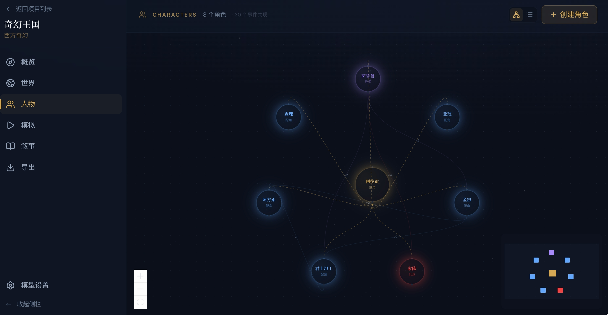
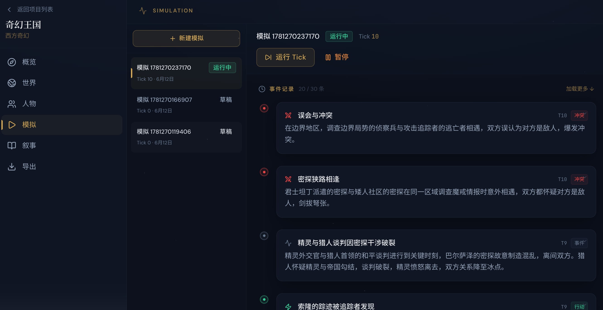

<div align="center">

# 🎭 Story Simulator

**AI-Powered Multi-Character Narrative Simulation & Screenplay Generation**

Run a sandbox world, let AI characters act autonomously, create conflicts, and drive the plot — then reassemble the objective event stream into structured narrative beats and scene scripts.

[](https://fastapi.tiangolo.com/)
[](https://nextjs.org/)
[](https://www.postgresql.org/)
[](https://platform.openai.com/)

[中文](./README.md)

</div>

---

## 📸 Screenshots

<table>
  <tr>
    <td align="center">Project Overview</td>
    <td align="center">Simulation Console</td>
  </tr>
  <tr>
    <td></td>
    <td></td>
  </tr>
</table>

---

## ✨ Features

### 🌍 World Building
- Define world geography, politics, economy, technology level, and power systems
- World fact management with lock/unlock and scope control

### 👥 Multi-Character System
- Character profiles: public vs. hidden identity, desires, fears, and false beliefs
- Character resources, relationship networks, secrets, knowledge bases, and character arc tracking

### ⚙️ Simulation Engine
- **Tick Pipeline**: Character Agent → World Judge → Conflict Resolution → Consistency Review → Event Commit
- Event sourcing: committed events are immutable; state can be rebuilt from the event stream
- Branching simulations: fork from any Tick to explore alternate storylines

### 📖 Narrative Workbench
- **Parallel Narratives**: create multiple narrative perspectives for the same simulation and compare different protagonists/structures
- 8 POV structures (single protagonist, dual protagonist, ensemble, anti-hero, detective, tragedy, villain, etc.)
- 6 narrative frameworks (Three-Act, Five-Act, Hero's Journey, Kishōtenketsu, Episodic)
- **Event Selection**: manually select key events to guide AI-generated plots
- AI-generated narrative beats → AI-generated scene scripts with dialogue

### 📤 Export
- Markdown / Fountain screenplay format export
- One-click generation after selecting a narrative perspective, direct browser download

### 🌐 Multilingual UI
- Chinese / English interface switching
- AI output language configurable independently

### ⚙️ Runtime Model Configuration
- Modify API Key, Base URL, model name, and parameters directly in the web UI
- Changes take effect immediately — no service restart needed
- Configuration persisted to a JSON file

---

## 🏗 System Architecture

```
┌─────────────┐     ┌──────────────────────┐     ┌─────────────┐
│  Next.js    │────▶│  FastAPI Backend     │────▶│ PostgreSQL  │
│  Frontend   │◀────│                      │     │   + Redis   │
└─────────────┘     │  ┌──────────────┐   │     └─────────────┘
                    │  │ 8 AI Agents  │   │
                    │  │ ┌────────────┐│   │
                    │  │ │ Character  ││   │
                    │  │ │ WorldJudge ││   │
                    │  │ │ Conflict   ││   │
                    │  │ │ Consistency││   │
                    │  │ │ Narrative  ││   │
                    │  │ │ Screenplay ││   │
                    │  │ │ Seed       ││   │
                    │  │ │ Faction    ││   │
                    │  │ └────────────┘│   │
                    │  └──────────────┘   │
                    └──────────────────────┘
```

**Supports any OpenAI-compatible API**: OpenAI, DeepSeek, Ollama, vLLM, etc.

---

## 🚀 Quick Start

### Docker Compose (Recommended)

```bash
git clone <repo-url>
cd agent-real-world

# 1. Configure LLM (first time)
cp .env.example .env
# Edit .env and fill in your API Key

# 2. Launch
docker compose up -d --build

# Frontend: http://localhost:3000
# Backend API Docs: http://localhost:8000/api/docs
```

After launch, you can modify LLM settings directly from the web UI via ⚙️ **Model Settings** — no need to edit `.env` manually.

### Local Development

```bash
# Backend
cd services/api
pip install -r requirements.txt
uvicorn app.main:app --reload --port 8000

# Frontend
cd apps/web
npm install
npm run dev
```

---

## 📁 Project Structure

```
agent-real-world/
├── apps/web/                          # Next.js Frontend
│   └── src/
│       ├── app/projects/[projectId]/  # 6 page tabs
│       │   ├── page.tsx               # Overview
│       │   ├── world/                 # World building
│       │   ├── characters/            # Character management
│       │   ├── simulation/            # Simulation console
│       │   ├── narrative/             # Narrative workbench
│       │   └── export/                # Export
│       ├── components/
│       │   └── SettingsDialog.tsx     # Model settings dialog
│       └── lib/
│           ├── api.ts                 # API client
│           └── i18n.tsx               # Internationalization
│
├── services/api/                      # FastAPI Backend
│   └── app/
│       ├── agents/                    # 8 AI Agents
│       │   ├── base_agent.py          # Agent base class
│       │   ├── llm_client.py          # LLM call client
│       │   ├── orchestrator.py        # Agent orchestrator
│       │   ├── character_agent.py     # Character intent generation
│       │   ├── world_judge.py         # World judge
│       │   ├── conflict_resolver.py   # Conflict resolution
│       │   ├── consistency_review.py  # Consistency review
│       │   ├── narrative_reconstruction.py  # Narrative beat generation
│       │   ├── screenplay_formatter.py      # Scene script generation
│       │   ├── seed_generation.py     # World seed generation
│       │   ├── faction_agent.py       # Faction agent
│       │   └── prompts/               # Prompt templates
│       ├── routers/                   # 9 API route groups
│       │   ├── projects.py
│       │   ├── worlds.py
│       │   ├── characters.py
│       │   ├── simulations.py
│       │   ├── narratives.py
│       │   ├── exports.py
│       │   ├── variables.py
│       │   └── settings.py
│       ├── models/                    # SQLAlchemy ORM models
│       ├── schemas/                   # Pydantic validation models
│       ├── services/                  # Core business logic
│       │   ├── simulation_engine.py   # Tick pipeline engine
│       │   ├── event_store.py         # Immutable event store
│       │   └── context_builder.py     # Agent context builder
│       └── core/
│           ├── config.py              # .env configuration
│           ├── database.py            # Database connection
│           └── runtime_config.py      # Runtime mutable config
│
├── doc/                               # Design documents
├── docker-compose.yml
└── .env                               # Environment variables
```

---

## 🧠 Core Concepts

### Tick Pipeline

Each simulation Tick executes a 7-step pipeline:

```
Build Character Context → Run Character Agents (parallel) → World Judge → Conflict Resolution
    → Consistency Review → Commit Events (immutable) → Update Character States
```

### Narrative Reconstruction

Objective Event Stream → AI Selection/Reassembly → Narrative Beats → Scene Scripts

Simulation and narrative are fully decoupled: the same set of events can generate multiple story versions from different protagonist perspectives and narrative structures.

### Event Immutability

Committed events can never be modified or deleted. The past is deterministic; only the future can be influenced through variable injection.

---

## 🔧 Configuration

### Environment Variables (`.env`)

| Variable | Description | Default |
|----------|-------------|---------|
| `OPENAI_API_KEY` | LLM API Key | `sk-placeholder` |
| `OPENAI_API_BASE` | API Base URL (empty = OpenAI official) | `""` |
| `LLM_MODEL` | Model name | `gpt-4o-mini` |
| `LLM_MAX_TOKENS` | Max output tokens | `4096` |
| `LLM_TEMPERATURE` | Temperature | `0.7` |
| `DATABASE_URL` | PostgreSQL connection string | Local Docker default |

All LLM settings can be modified in real-time from the web UI via **⚙️ Model Settings** — no restart required.

---

## 🛠 Tech Stack

| Layer | Technology |
|-------|------------|
| Frontend | Next.js 15, React 19, TanStack Query, Tailwind CSS |
| Backend | FastAPI, SQLAlchemy 2.0 (async), Pydantic v2 |
| AI | OpenAI Python SDK, 8-Agent Architecture |
| Database | PostgreSQL 16 |
| Cache/Queue | Redis 7, Celery |
| Deployment | Docker Compose |

---

## 📄 License

MIT
